  

<h3 align="center">Scalable Earth observation, from raw satellite imagery to production APIs</h3>

PhD researcher at the University of Leeds. I build cloud-native pipelines that turn optical and SAR satellite data into environmental monitoring products, combining remote sensing, machine learning and cloud engineering.

<!-- EDIT: replace with your real links -->

  
  
  

---

### Pipeline

| | Stage | Tools |
|:-:|---|---|
| 🟦 | **Ingest** imagery from STAC catalogues and Earth Engine into Cloud Storage | STAC, Earth Engine, Cloud Optimized GeoTIFF, Zarr |
| 🟨 | **Process** at scale: SAR calibration, speckle filtering, compositing, features | Dask, xarray, rasterio, GDAL, ESA SNAP |
| 🟩 | **Model** land cover and change, validated per region and year | scikit-learn, Random Forest, XGBoost, PyTorch |
| 🌲 | **Serve** results as APIs, apps and dashboards | FastAPI, BigQuery, React, Streamlit, Cloud Run |

### Satellite data

| Radar | Optical | Platforms |
|---|---|---|
| Sentinel-1 SAR, backscatter analysis, InSAR | Sentinel-2, Landsat, MODIS, PlanetScope | Google Earth Engine, openEO, QGIS, ArcGIS Pro |

### Stack

  
  
  
  
  
  
  
  
  
  
  
  
  
  
  

---

Open to collaborations on scalable geospatial pipelines, machine learning for Earth observation and environmental monitoring systems.

